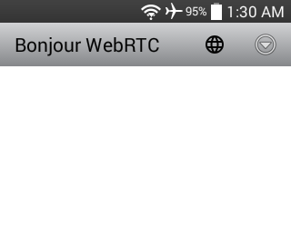
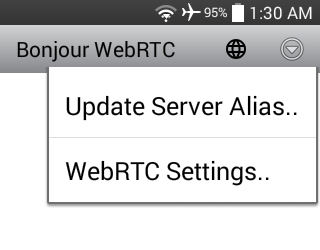
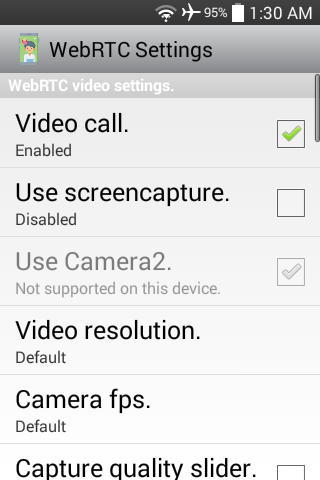
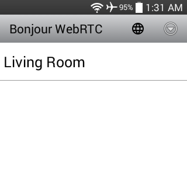
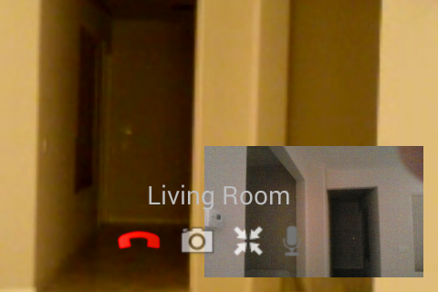

#### [Bonjour WebRTC](https://github.com/warren-bank/Android-Bonjour-WebRTC)

Android app that allows device discovery on WLAN (w/ Bonjour) and video calls to be placed between devices on WLAN (w/ WebRTC) without any external server.

#### Screenshots

#### Notes

* minimum supported version of Android:
  * Android 4.1 (API level 16)

#### Usage

* when the Service is not running
  - your app displays a list of other devices on the WLAN that are running the Service
  - you can initiate a call to any of these devices
* when the Service is running
  - other devices on the WLAN will see your device in their lists
  - any of these devices can initiate a call to you
* when the app is launched
  - the Service is not running
* when you click this icon  in the top menu
  - you can specify the alias that other users will see in their lists that identifies your device on the WLAN
  - if not customized, the default value is your IP address on the WLAN
* when you click this icon  in the top menu
  - the Service will toggle between _on_ and _off_
    * in the _on_ state
      - a notification will always be visible, which will reopen the app when clicked
      - resource locks will be active to:
        * keep the CPU awake
        * keep the WiFi radio awake and connected
        * enable listening for multicast packets
    * in the _off_ state
      - the notification is dismissed
      - all resource locks are removed

#### Credits

* [jmDNS library](https://github.com/jmdns/jmdns)
  - handles all Bonjour service registration/discovery
* [WebRTC prebuilt native libraries with JNI wrapper](https://webrtc.org/native-code/android/)
* WebRTC _AppRTCMobile_ example Android application
  - [official source](https://webrtc.googlesource.com/src/+/master/examples/androidapp/)
  - [unofficial build](https://github.com/warren-bank/Android-AppRTCMobile)

#### Legal:

* copyright: [Warren Bank](https://github.com/warren-bank)
* license: [GPL-2.0](https://www.gnu.org/licenses/old-licenses/gpl-2.0.txt)
